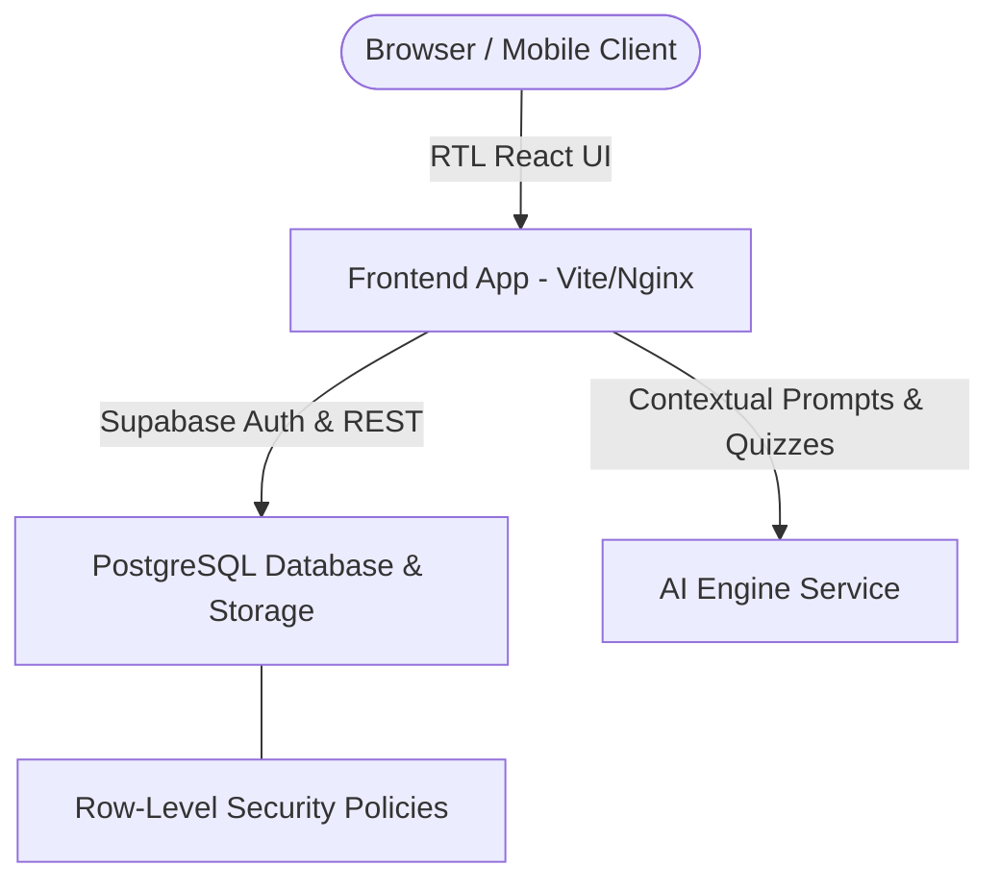

# 🎓 Ta3 (تعلّم) - Modern Arabic-First AI-Boosted LMS

> **Ta3 (تعلّم)** is a high-aesthetic, RTL-native, AI-native Learning Management System (LMS) designed for modern education across the MENA region. Built with React 18, TypeScript, Tailwind CSS, Supabase, and PostgreSQL.

---

## 📌 Executive Overview

Ta3 connects Students, Teachers, and Administrators in a unified, role-based platform that features adaptive AI tutoring, dynamic lesson blocks, and frictionless course management.



---

## 🚀 Quick Start (Local Development)

### 1. Prerequisites
- **Node.js**: v20+
- **Docker & Docker Compose**: Installed and running

### 2. Environment Setup
Copy the environment template and configure your keys:
```bash
cp .env.example .env.local
```

### 3. Run Locally with Vite
```bash
npm install
npm run dev
```

### 4. Run Full Stack with Docker Compose
```bash
docker-compose up -d --build
```
Access the application at `http://localhost:8080`.

---

## 🏃 Product Roadmap & Sprints

*   **Sprint 1: Foundation, Auth & Base API Integration**
    *   Supabase Auth integration, PostgreSQL schema migrations (`erd.md`), RLS policy enforcement, Docker setup.
*   **Sprint 2: Core LMS Workflows & AI Micro-Features**
    *   Student assignment upload dropzone, teacher grading interface, AI auto-quiz generator.
*   **Sprint 3: Dockerization, Hardening & Public Readiness**
    *   Nginx reverse proxy, container security audit, performance load testing, public cloud deployment manifests.

---

## 📄 Key Architecture Documents
- 📐 [arch.md](arch.md) - Full Frontend & Component Architecture
- 🗄️ [erd.md](erd.md) - Database Schema & ERD Diagram
- 🤖 [ta3.v3.md](ta3.v3.md) - AI Platform & Ecosystem Specification
- 🗂️ [.github/PROJECTS.md](.github/PROJECTS.md) - Master Issues & Kanban Board
