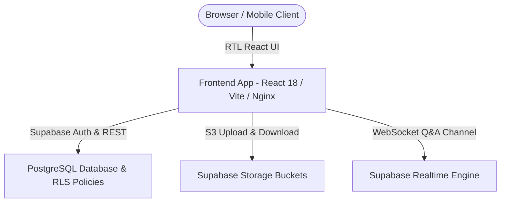

# 🎓 Ta3 (تعلّم) - Modern Arabic-First Enterprise LMS

> **Ta3 (تعلّم)** is a high-aesthetic, RTL-native, enterprise-grade Learning Management System (LMS) designed for modern education across the MENA region. Built with React 18, TypeScript, Tailwind CSS, Supabase, and PostgreSQL.

---

## 📌 Executive Overview

Ta3 connects Students, Teachers, and Administrators in a unified, role-based platform that features real-time Q&A discussions, cloud file storage, database-enforced Row-Level Security (RLS), and adaptive academic dashboards.



---

## 🚀 Quick Start (Local Development)

### 1. Prerequisites
- **Node.js**: v20+
- **npm** or **pnpm**

### 2. Environment Setup
Copy the environment template and configure your keys:
```bash
cp .env.example .env.local
```

### 3. Run Locally with Vite
```bash
npm install
npm run dev
```

### 4. Run Tests
```bash
npx vitest run src/
```

### 5. Deploy to GitHub Pages
```bash
npm run git
```

---

## 🏃 Product Master Roadmap

- ✅ **Sprint 1 (Days 1–5): Foundation & Role-Based UI Architecture**
  - Isolated student, teacher, and admin dashboards; unified course detail view (`Courses.tsx`); study groups catalog (`Groups.tsx`); academic calendar (`GlobalCalendarDialog.tsx`); asset path resolution (`getAssetUrl`).
- ✅ **Sprint 2 (Days 6–9): PostgreSQL, Supabase Auth, Cloud Storage & Real-time Q&A**
  - PostgreSQL relational schema (`001_initial_schema.sql`), seed data (`002_seed_data.sql`), Supabase Auth SDK & RLS policies (`003_rls_policies.sql`), Supabase Storage file uploads (`005_storage_buckets.sql`, `storage.ts`), real-time WebSocket discussions & solution marking (`discussions.ts`).
- 📋 **Sprint 2 Resiliency & Production Release (Days 10–13)**
  - Docker multi-stage build & Nginx staging, CQRS read/write separation, Idempotency key manager, Optimistic Concurrency Control (OCC locking), high-concurrency performance tuning, and Playwright release verification (`v2.0-beta`).

---

## 📄 Core Documentation
- 📐 [arch.md](arch.md) - Comprehensive Frontend & Backend C4 / Standard Mermaid Architecture Spec
- 🗄️ [erd.md](erd.md) - PostgreSQL Relational Database Schema & ERD Specification
- 🏆 [.agents/REWARDS_PUNISHMENTS.md](.agents/REWARDS_PUNISHMENTS.md) - Agent Team Leaderboard & XP Progression
- 📜 [.agents/AGENTS.md](.agents/AGENTS.md) - Agent Operating System & Mandatory Git Rules
- 🗂️ [.github/PROJECTS.md](.github/PROJECTS.md) - Master Milestone Schedule & Task Status
