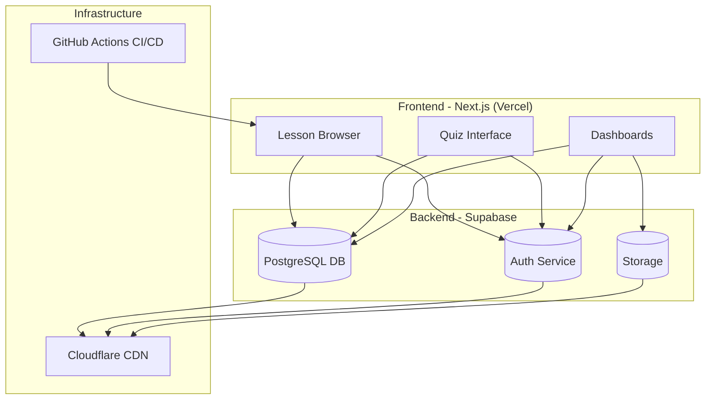
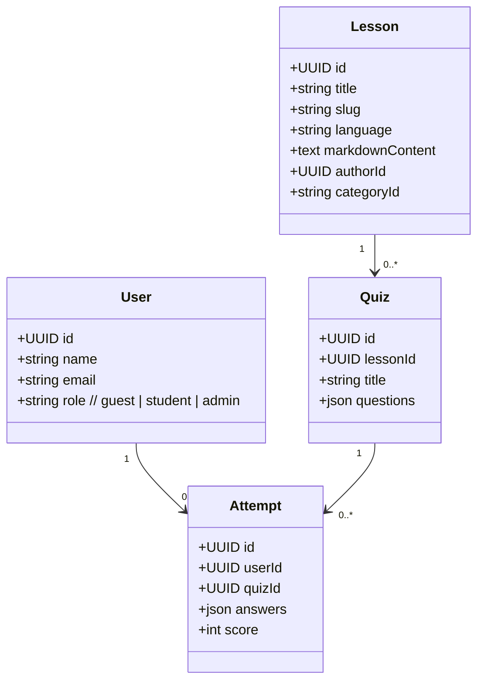

# System Architecture

```mermaid
graph TD
    subgraph "Frontend - Next.js (Vercel)"
        A[Lesson Browser]
        B[Quiz Interface]
        C[Dashboards]
    end

    subgraph "Backend - Supabase"
        D[(PostgreSQL DB)]
        E[(Auth Service)]
        F[(Storage)]
    end

    subgraph "Infrastructure"
        G[Cloudflare CDN]
        H[GitHub Actions CI/CD]
    end

    A --> D
    B --> D
    C --> D
    A --> E
    B --> E
    C --> E
    C --> F
    D --> G
    E --> G
    F --> G
    H --> A
```
# Class Diagram

```mermaid
classDiagram
    class User {
        +UUID id
        +string name
        +string email
        +string role // guest | student | admin
    }

    class Lesson {
        +UUID id
        +string title
        +string slug
        +string language
        +text markdownContent
        +UUID authorId
        +string categoryId
    }

    class Quiz {
        +UUID id
        +UUID lessonId
        +string title
        +json questions
    }

    class Attempt {
        +UUID id
        +UUID userId
        +UUID quizId
        +json answers
        +int score
    }

    User "1" --> "0..*" Attempt
    Lesson "1" --> "0..*" Quiz
    Quiz "1" --> "0..*" Attempt

```

