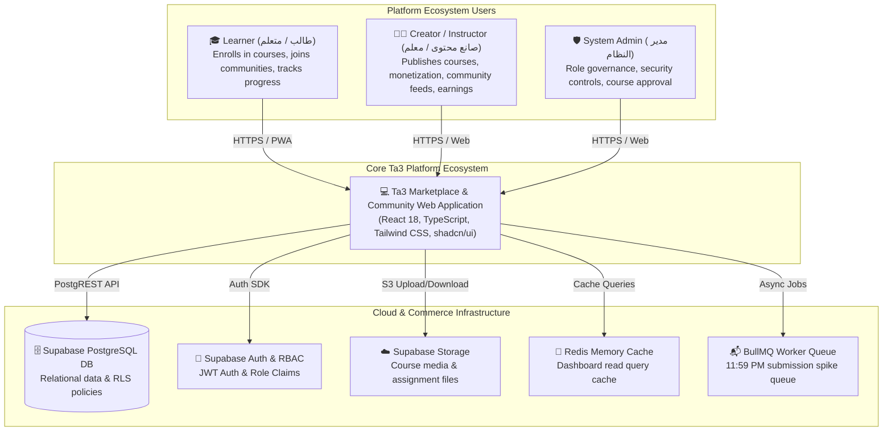
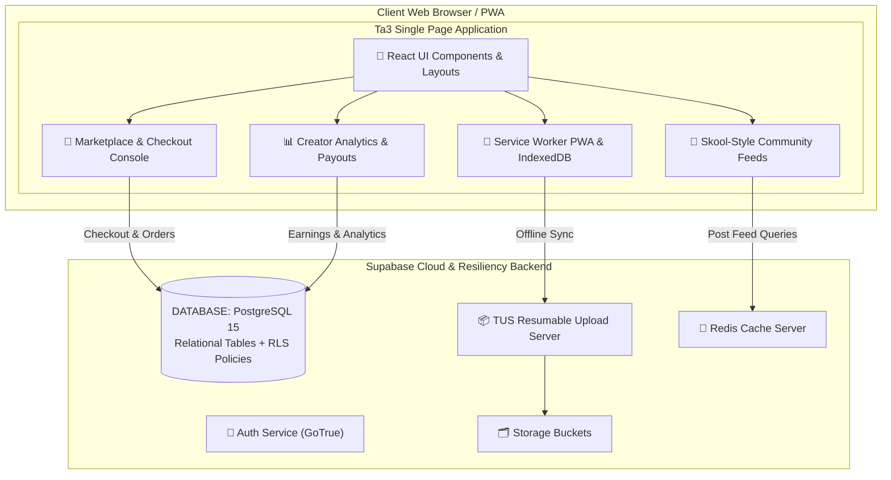
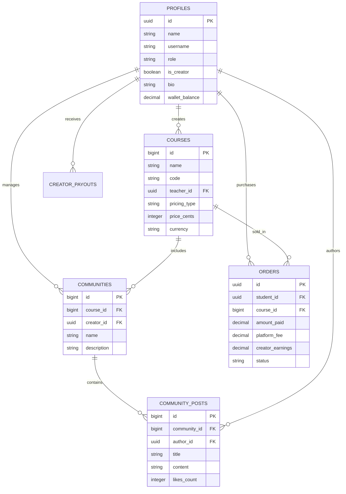

# Ta3 (تعلّم) - Arabic Learning Marketplace & Creator Platform Architecture

## Executive Overview
**Ta3 (تعلّم)** is an enterprise-grade, Arabic-native Learning Marketplace & Creator Community Platform (*Skool + Udemy + Coursera for the MENA Region*) built with React 18, TypeScript, Tailwind CSS, `shadcn/ui`, and a hybrid Supabase PostgreSQL backend with resilient CQRS, PWA offline engines, and cloud infrastructure.

The platform provides unified experiences for **Learners**, **Creators**, **Institutions**, and **System Administrators**, combining course delivery (LMS), creator monetization, Skool-style community feeds, and high-concurrency Levant infrastructure (PWA, TUS resumable uploads, Redis caching).

---

## 🏛️ System Architecture Diagrams (Mermaid)

### Level 1: System Context Diagram
The System Context diagram displays how different users interact with **Ta3 Ecosystem** and external cloud providers.

---

### Level 2: Container Diagram (Marketplace, Community & LMS)

---

### Level 3: Code & Data Model Diagram (Expanded Marketplace Schema)

---

## 🎨 Theme & Brand Color Guidelines (Strictly Preserved)
- **Primary**:
  - `Mountain Teal`: `#428177`
  - `Ivory Mist`: `#EDEBE0`
  - `Damask Red`: `#6B1F2A`
  - `White`: `#FFFFFF`
- **Secondary**:
  - `Forest`: `#002623`
  - `Emerald Shadow`: `#054239`
  - `Golden Wheat`: `#988561`
  - `Antique Sand`: `#B9A779`
  - `Deep Umber`: `#260F14`
  - `Black Cherry`: `#4A151E`
  - `Charcoal`: `#161616`
  - `Stone`: `#3D3A3B`
- **Typography & Numerals**: RTL layout alignment, standard Arabic digits (1, 2, 3, 4, 5, 6, 7, 8, 9, 0).
