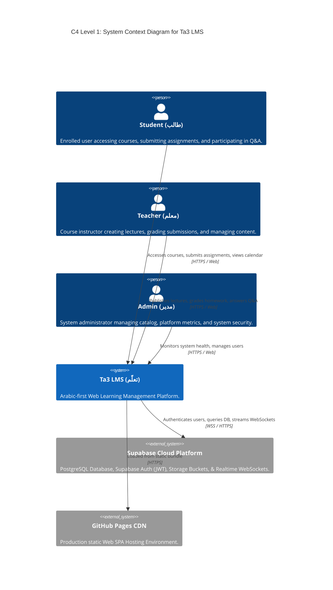
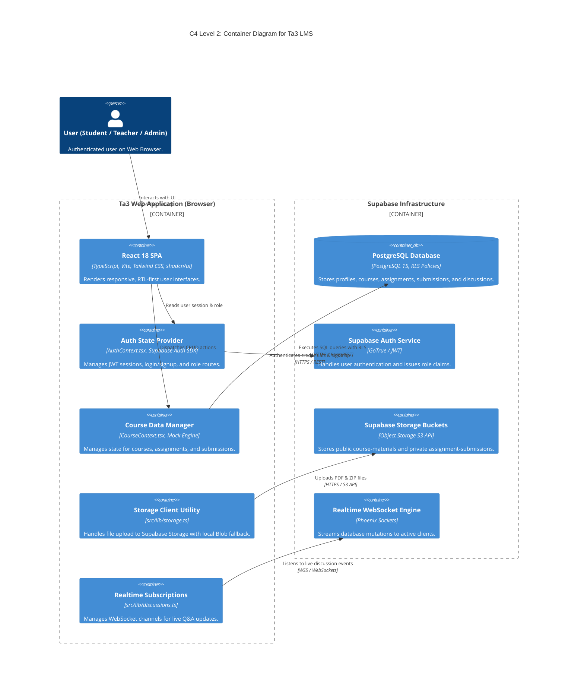
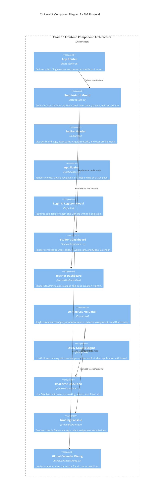
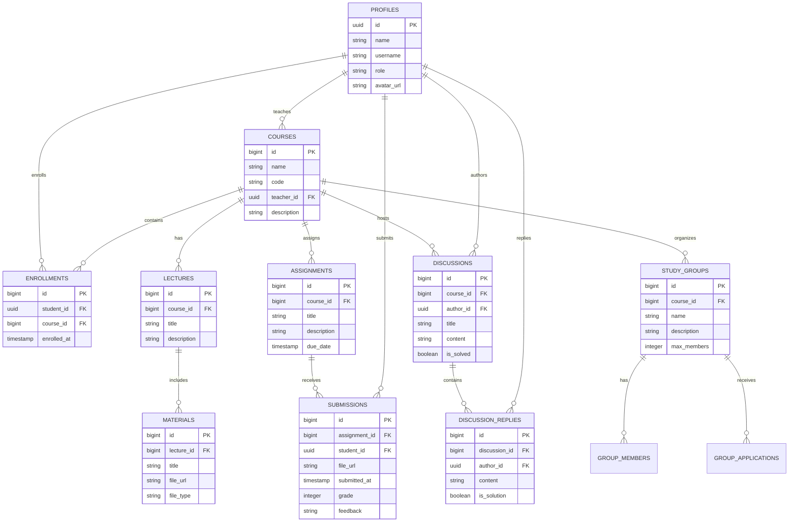

# Ta3 (تعلّم) - Learning Management System Architecture

## Executive Overview
**Ta3 (تعلّم)** is an enterprise-grade, Arabic-first Learning Management System (LMS) built with React 18, TypeScript, Tailwind CSS, `shadcn/ui`, and a hybrid Supabase PostgreSQL backend with resilient local fallback engines.

The platform provides isolated role-based experiences for **Students**, **Teachers**, and **System Administrators**, featuring real-time WebSocket Q&A discussions, cloud file storage, academic calendar tracking, and database-enforced Row-Level Security (RLS).

---

## 🏛️ C4 Model Architecture Diagrams

### Level 1: System Context Diagram
The System Context diagram displays how different academic roles interact with **Ta3 LMS** and external cloud providers.



---

### Level 2: Container Diagram
The Container diagram details the high-level technical building blocks of **Ta3 LMS**.



---

### Level 3: Component Diagram (Frontend SPA & Modules)
The Component diagram breaks down the internal modules inside the React SPA.



---

### Level 4: Code & Data Model Diagram (PostgreSQL Relational Schema)
The Code/Data diagram displays the database tables, relationships, and constraints established in `001_initial_schema.sql`.



---

## 🛠️ Implemented System Architecture & Features

### 1. Role-Based Access Control (RBAC) & Session Management
- **3 Isolated Roles**: `student`, `teacher`, `admin`.
- **Hybrid Auth Provider (`AuthContext.tsx`)**:
  - Consumes `supabase.auth.signInWithPassword()`, `signUp()`, and `signOut()`.
  - Automatically listens to `supabase.auth.onAuthStateChange()` to maintain persistent JWT logins across page reloads.
  - Supports rapid developer quick-selection with automatic mock engine fallbacks.

### 2. Unified Course Interface (`Courses.tsx`)
- Single unified container component serving both Students and Teachers.
- Dynamic conditional rendering of edit/delete controls based on `user.role`.
- Tabs for **Announcements**, **Lectures**, **Assignments**, **Discussions**, and **Help Guide**.

### 3. Study Groups Engine (`Groups.tsx`)
- Supports **List View (Default)** and **Grid View** layout toggling.
- Teacher-exclusive group creation and **Group Deletion** triggers.
- Student group application submission with **Application Cancellation (`إلغاء طلب الانضمام`)**.

### 4. Real-time Q&A & Discussion Engine (`CourseDiscussions.tsx`)
- Powered by `subscribeToDiscussions()` WebSocket channel helper (`src/lib/discussions.ts`).
- **Verified Solution Marking ("علامة الإجابة الصحيحة")**: Teachers and discussion authors can designate best answers with visual verified badges.
- **Search & Filtering**: Interactive search bar and filter tabs for **All Topics**, **Unanswered Questions**, and **Solved Questions**.

### 5. Cloud File Storage Integration (`src/lib/storage.ts`)
- Configured Supabase Storage Buckets (`005_storage_buckets.sql`):
  - `course-materials` (Public, 50 MB limit): Lecture PDFs, slides, and documents.
  - `assignment-submissions` (Private, 50 MB limit): Student homework PDFs & ZIP files.
- Connected `AssignmentSubmissions.tsx` for uploading actual files directly to cloud storage.

### 6. Robustness & Resiliency Architecture
- **Idempotency & Race-Condition Safeguards**: Database triggers (`ON CONFLICT DO UPDATE`) and storage `upsert: true` parameters prevent duplicate insertion crashes.
- **Data Integrity**: Foreign key `ON DELETE CASCADE` constraints prevent orphaned database records.
- **Row-Level Security (RLS)**: Enforced database-level security policies (`003_rls_policies.sql`) for role isolation.

---

## 📁 Updated File Structure

```
ta3/
├── .github/
│   └── 3_WEEK_ROADMAP.md             # Master 3-Week Development Roadmap
├── .agents/
│   ├── AGENTS.md                      # Team Roster & Git Operating Rules
│   └── REWARDS_PUNISHMENTS.md         # Leaderboard & XP Framework
├── supabase/
│   └── migrations/
│       ├── 20260810000000_001_initial_schema.sql  # 12 Relational Tables
│       ├── 20260810000001_002_seed_data.sql       # Arabic Seed Data
│       ├── 20260811000000_003_rls_policies.sql    # Row-Level Security Policies
│       ├── 20260811000001_004_auth_triggers.sql   # User Profile Auto-Trigger
│       └── 20260812000000_005_storage_buckets.sql # Storage Buckets & Policies
├── src/
│   ├── components/
│   │   ├── courses/
│   │   │   ├── AnnouncementDialog.tsx
│   │   │   ├── AssignmentDialog.tsx
│   │   │   ├── AssignmentSubmissions.tsx
│   │   │   ├── CourseDiscussions.tsx
│   │   │   ├── EventDialog.tsx
│   │   │   ├── GradingConsole.tsx
│   │   │   ├── LectureDialog.tsx
│   │   │   └── MaterialViewerModal.tsx
│   │   ├── layout/
│   │   │   ├── DashboardLayout.tsx
│   │   │   ├── RequireAuth.tsx
│   │   │   └── RoleQuickSelector.tsx
│   │   ├── student/
│   │   │   ├── CourseCard.tsx
│   │   │   ├── GlobalCalendarDialog.tsx
│   │   │   └── LectureDetail.tsx
│   │   └── topbar/
│   │       ├── AppSidebar.tsx
│   │       └── TopBar.tsx
│   ├── contexts/
│   │   ├── AuthContext.tsx           # Supabase + Mock Auth Provider
│   │   └── CourseContext.tsx         # Course State Manager
│   ├── lib/
│   │   ├── assetUtils.ts             # Vite BASE_URL Asset Helper
│   │   ├── discussions.ts            # Supabase Realtime WebSocket Helper
│   │   ├── MockAuthEngine.ts         # Local Storage Auth Fallback
│   │   ├── storage.ts                # Supabase Storage Client Helper
│   │   ├── supabase.ts               # Singleton Supabase Client
│   │   └── supabaseClient.ts         # Supabase Client Re-exporter
│   ├── pages/
│   │   ├── admin/AdminDashboard.tsx
│   │   ├── courses/
│   │   │   ├── Courses.tsx           # Unified Course View
│   │   │   └── Groups.tsx            # Study Groups Catalog
│   │   ├── student/StudentDashboard.tsx
│   │   ├── teacher/TeacherDashboard.tsx
│   │   └── Login.tsx                 # Login & Registration SPA Page
│   └── types/
│       ├── supabase.ts               # Database TypeScript Interface Definitions
│       └── user.ts                   # User Roles & Profiles
├── arch.md                            # Comprehensive C4 Architecture Spec
├── erd.md                             # Entity Relationship Diagram & Schema Docs
└── README.md                          # Master Project README
```

---

## ⚡ Technology Stack & Dependencies

| Layer | Technology / Library | Version | Purpose |
| :--- | :--- | :--- | :--- |
| **Core Framework** | React | `18.3.1` | UI Library with Concurrent Features |
| **Language** | TypeScript | `5.x` | Strict Static Typing & Schema Security |
| **Build System** | Vite | `5.x` | High-speed SPA Bundling & HMR |
| **Routing** | React Router DOM | `6.x` | Client-Side SPA Navigation & Protection |
| **UI Components** | `shadcn/ui` / Radix UI | Latest | Accessible Headless Design Primitives |
| **Styling** | Tailwind CSS | `3.4.x` | Custom Utility-First Styling & RTL Layouts |
| **Backend & DB** | Supabase / PostgreSQL | `15.x` | Auth, RLS Policies, Relational Storage |
| **Cloud Storage** | Supabase Storage | S3 API | Storage for PDFs, DOCX, & ZIP Submissions |
| **Realtime Engine** | Supabase Realtime | WebSockets | Live Q&A Stream & Discussion Events |
| **Testing** | Vitest & Playwright | Latest | Unit, Component, and E2E Smoke Testing |
