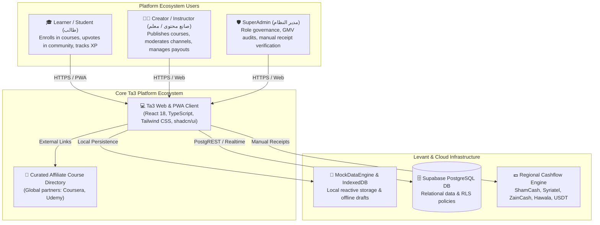
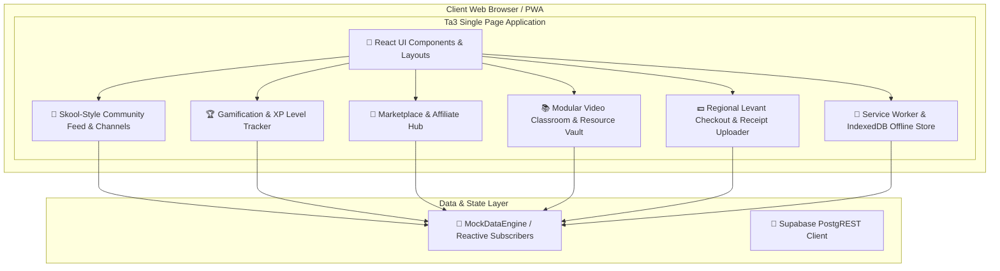
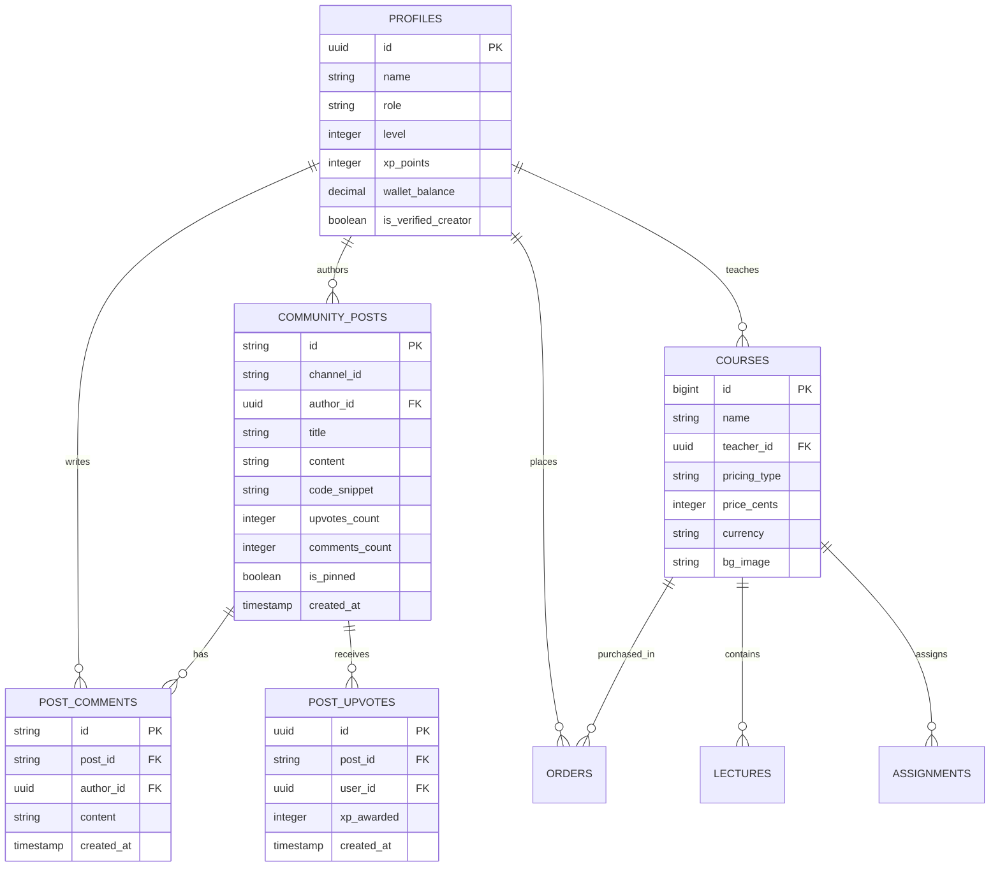

# 🏛️ Ta3 (تعلّم) — System Architecture Specification

## Executive Overview
**Ta3 (تعلّم)** is an enterprise-grade, Arabic-native Learning Marketplace & Creator Community Platform (*The Skool + Udemy + Coursera of the MENA Region*) built with React 18, TypeScript, Tailwind CSS, `shadcn/ui`, and a resilient local/hybrid Supabase PostgreSQL backend with offline-first PWA caching and regional Levant payment engines.

The platform provides unified, role-segregated experiences for **Learners**, **Creators/Instructors**, and **SuperAdmins**, eliminating AI cloud operational overhead in favor of authentic community engagement, structured video learning, live cohort calendars, and regional cashflow mechanics.

---

## 🏛️ System Architecture Diagrams (Mermaid)

### Level 1: System Context Diagram
The System Context diagram displays how users and regional infrastructure interact with the **Ta3 Ecosystem**.

```mermaid
graph TD
    subgraph Users [" Platform Ecosystem Users "]
        Learner["🎓 Learner / Student (طالب)<br/>Enrolls in courses, upvotes in community, tracks XP"]
        Creator["👨‍🏫 Creator / Instructor (صانع محتوى / معلم)<br/>Publishes courses, moderates channels, manages payouts"]
        Admin["🛡️ SuperAdmin (مدير النظام)<br/>Role governance, GMV audits, manual receipt verification"]
    end

    subgraph Platform [" Core Ta3 Platform Ecosystem "]
        Ta3App["💻 Ta3 Web & PWA Client<br/>(React 18, TypeScript, Tailwind CSS, shadcn/ui)"]
        AffiliateHub["🔗 Curated Affiliate Course Directory<br/>(Global partners: Coursera, Udemy)"]
    end

    subgraph Infrastructure [" Levant & Cloud Infrastructure "]
        MockEngine["💾 MockDataEngine & IndexedDB<br/>Local reactive storage & offline drafts"]
        SupabaseDB[("🗄️ Supabase PostgreSQL DB<br/>Relational data & RLS policies")]
        LevantGateways["💵 Regional Cashflow Engine<br/>ShamCash, Syriatel, ZainCash, Hawala, USDT"]
    end

    Learner -->|HTTPS / PWA| Ta3App
    Creator -->|HTTPS / Web| Ta3App
    Admin -->|HTTPS / Web| Ta3App

    Ta3App -->|Local Persistence| MockEngine
    Ta3App -->|PostgREST / Realtime| SupabaseDB
    Ta3App -->|External Links| AffiliateHub
    Ta3App -->|Manual Receipts| LevantGateways
```

---

### Level 2: Skool-Style Community & Classroom Container Diagram

```mermaid
graph TD
    subgraph Browser [" Client Web Browser / PWA "]
        subgraph FrontendSPA [" Ta3 Single Page Application "]
            UI["📱 React UI Components & Layouts"]
            CommunityUI["💬 Skool-Style Community Feed & Channels"]
            LeaderboardUI["🏆 Gamification & XP Level Tracker"]
            MarketplaceUI["🛒 Marketplace & Affiliate Hub"]
            ClassroomUI["📚 Modular Video Classroom & Resource Vault"]
            PaymentUI["💵 Regional Levant Checkout & Receipt Uploader"]
            PWAEngine["🔌 Service Worker & IndexedDB Offline Store"]
        end
    end

    subgraph Storage [" Data & State Layer "]
        LocalState["💾 MockDataEngine / Reactive Subscribers"]
        SupabaseClient["🔑 Supabase PostgREST Client"]
    end

    UI --> CommunityUI
    UI --> LeaderboardUI
    UI --> MarketplaceUI
    UI --> ClassroomUI
    UI --> PaymentUI
    UI --> PWAEngine

    CommunityUI --> LocalState
    LeaderboardUI --> LocalState
    MarketplaceUI --> LocalState
    ClassroomUI --> LocalState
    PaymentUI --> LocalState
    PWAEngine --> LocalState
```

---

### Level 3: Data Model & Gamification Entity Relationships

```mermaid
erDiagram
    PROFILES ||--o{ COMMUNITY_POSTS : "authors"
    PROFILES ||--o{ POST_COMMENTS : "writes"
    COMMUNITY_POSTS ||--o{ POST_COMMENTS : "has"
    COMMUNITY_POSTS ||--o{ POST_UPVOTES : "receives"
    PROFILES ||--o{ COURSES : "teaches"
    PROFILES ||--o{ ORDERS : "places"
    COURSES ||--o{ ORDERS : "purchased_in"
    COURSES ||--o{ LECTURES : "contains"
    COURSES ||--o{ ASSIGNMENTS : "assigns"

    PROFILES {
        uuid id PK
        string name
        string role
        integer level
        integer xp_points
        decimal wallet_balance
        boolean is_verified_creator
    }

    COMMUNITY_POSTS {
        string id PK
        string channel_id
        uuid author_id FK
        string title
        string content
        string code_snippet
        integer upvotes_count
        integer comments_count
        boolean is_pinned
        timestamp created_at
    }

    POST_COMMENTS {
        string id PK
        string post_id FK
        uuid author_id FK
        string content
        timestamp created_at
    }

    POST_UPVOTES {
        uuid id PK
        string post_id FK
        uuid user_id FK
        integer xp_awarded
        timestamp created_at
    }

    COURSES {
        bigint id PK
        string name
        uuid teacher_id FK
        string pricing_type
        integer price_cents
        string currency
        string bg_image
    }
```

---

## 🎨 Brand Design Tokens (Strictly Preserved)
- **Primary**:
  - `Mountain Teal`: `#428177`
  - `Ivory Mist`: `#EDEBE0`
  - `Damask Red`: `#6B1F2A`
  - `White`: `#FFFFFF`
- **Secondary**:
  - `Forest`: `#002623`
  - `Emerald Shadow`: `#054239`
  - `Golden Wheat`: `#988561`
  - `Antique Sand`: `#B9A779`
- **Typography**: Native Arabic RTL, Standard Arabic Numerals (1, 2, 3, 4, 5, 6, 7, 8, 9, 0).
