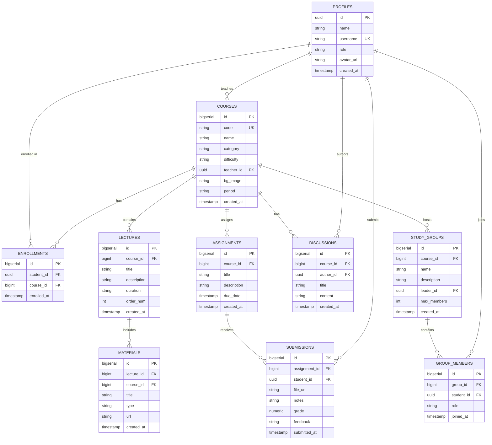

# 🗄️ PostgreSQL Database ERD Schema: Ta3 (تعلّم) LMS

```mermaid
erDiagram
    PROFILES ||--o{ COURSES : "teaches"
    PROFILES ||--o{ ENROLLMENTS : "enrolled in"
    COURSES ||--o{ ENROLLMENTS : "has"
    COURSES ||--o{ LECTURES : "contains"
    LECTURES ||--o{ MATERIALS : "includes"
    COURSES ||--o{ ASSIGNMENTS : "assigns"
    ASSIGNMENTS ||--o{ SUBMISSIONS : "receives"
    PROFILES ||--o{ SUBMISSIONS : "submits"
    COURSES ||--o{ DISCUSSIONS : "has"
    PROFILES ||--o{ DISCUSSIONS : "authors"
    COURSES ||--o{ STUDY_GROUPS : "hosts"
    STUDY_GROUPS ||--o{ GROUP_MEMBERS : "contains"
    PROFILES ||--o{ GROUP_MEMBERS : "joins"

    PROFILES {
        uuid id PK
        string name
        string username UK
        string role
        string avatar_url
        timestamp created_at
    }

    COURSES {
        bigserial id PK
        string code UK
        string name
        string category
        string difficulty
        uuid teacher_id FK
        string bg_image
        string period
        timestamp created_at
    }

    ENROLLMENTS {
        bigserial id PK
        uuid student_id FK
        bigint course_id FK
        timestamp enrolled_at
    }

    LECTURES {
        bigserial id PK
        bigint course_id FK
        string title
        string description
        string duration
        int order_num
        timestamp created_at
    }

    MATERIALS {
        bigserial id PK
        bigint lecture_id FK
        bigint course_id FK
        string title
        string type
        string url
        timestamp created_at
    }

    ASSIGNMENTS {
        bigserial id PK
        bigint course_id FK
        string title
        string description
        timestamp due_date
        timestamp created_at
    }

    SUBMISSIONS {
        bigserial id PK
        bigint assignment_id FK
        uuid student_id FK
        string file_url
        string notes
        numeric grade
        string feedback
        timestamp submitted_at
    }

    DISCUSSIONS {
        bigserial id PK
        bigint course_id FK
        uuid author_id FK
        string title
        string content
        timestamp created_at
    }

    STUDY_GROUPS {
        bigserial id PK
        bigint course_id FK
        string name
        string description
        uuid leader_id FK
        int max_members
        timestamp created_at
    }

    GROUP_MEMBERS {
        bigserial id PK
        bigint group_id FK
        uuid student_id FK
        string role
        timestamp joined_at
    }
```
