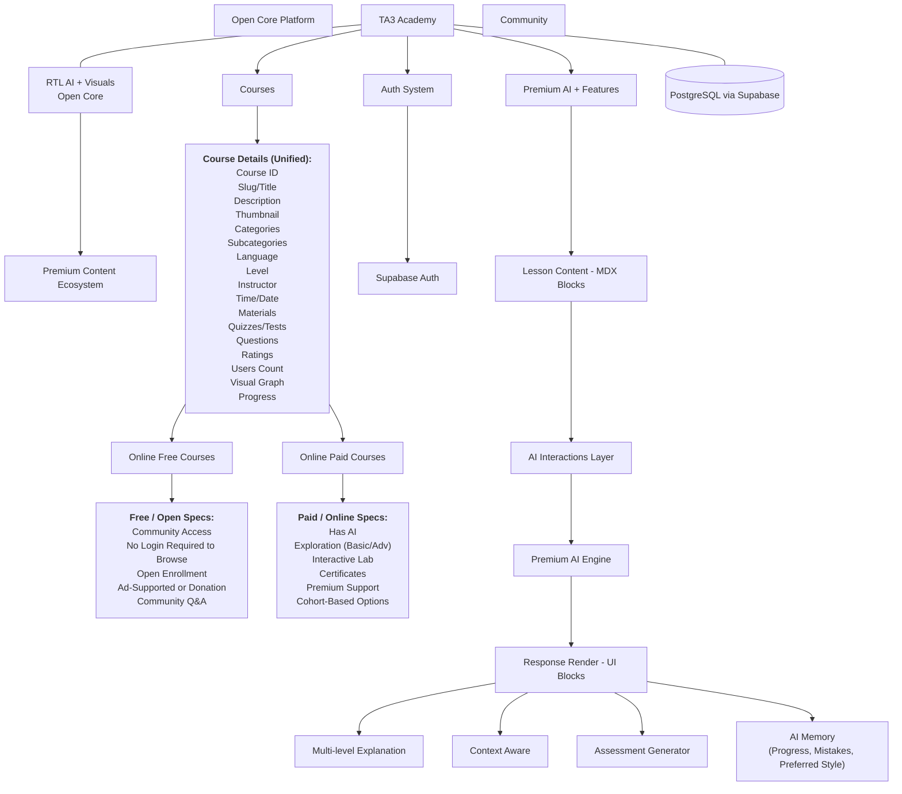

```mermaid
graph TD
    %% Top Level
    Platform[Open Core Platform]
    TA3[TA3 Academy]
    SchoolID[Community]
    RTL[RTL AI + Visuals <br/> Open Core]
    Ecosystem[Premium Content Ecosystem]

    TA3 --- RTL
    RTL --> Ecosystem

    %% Main Branches from TA3
    TA3 --> Courses
    Courses --> CourseDetails["<b>Course Details (Unified):</b><br/>Course ID<br/>Slug/Title<br/>Description<br/>Thumbnail<br/>Categories<br/>Subcategories<br/>Language<br/>Level<br/>Instructor<br/>Time/Date<br/>Materials<br/>Quizzes/Tests<br/>Questions<br/>Ratings<br/>Users Count<br/>Visual Graph<br/>Progress"]
    TA3 --> Auth[Auth System]
    TA3 --> Premium[Premium AI + Features]
    %% Course Types (branch from Course Details)
    CourseDetails --> Free[Online Free Courses]
    CourseDetails --> Paid[Online Paid Courses]

    %% Free Course Specs
    Free --> FreeSpecs["<b>Free / Open Specs:</b><br/>Community Access<br/>No Login Required to Browse<br/>Open Enrollment<br/>Ad-Supported or Donation<br/>Community Q&A"]

    %% Paid / Online Course Specs
    Paid --> PaidSpecs["<b>Paid / Online Specs:</b><br/>Has AI<br/>Exploration (Basic/Adv)<br/>Interactive Lab<br/>Certificates<br/>Premium Support<br/>Cohort-Based Options"]

    %% Auth System
    Auth --> SupabaseAuth[Supabase Auth]

    %% Database
    TA3 --- DB[(PostgreSQL via Supabase)]

    %% Premium AI Stack
    Premium --> Content[Lesson Content - MDX Blocks]
    Content --> Interaction[AI Interactions Layer]
    Interaction --> Engine[Premium AI Engine]
    Engine --> Render[Response Render - UI Blocks]

    %% AI Capabilities
    Render --> Multi[Multi-level Explanation]
    Render --> Context[Context Aware]
    Render --> Assess[Assessment Generator]
    Render --> Memory["AI Memory<br/>(Progress, Mistakes, Preferred Style)"]
```
